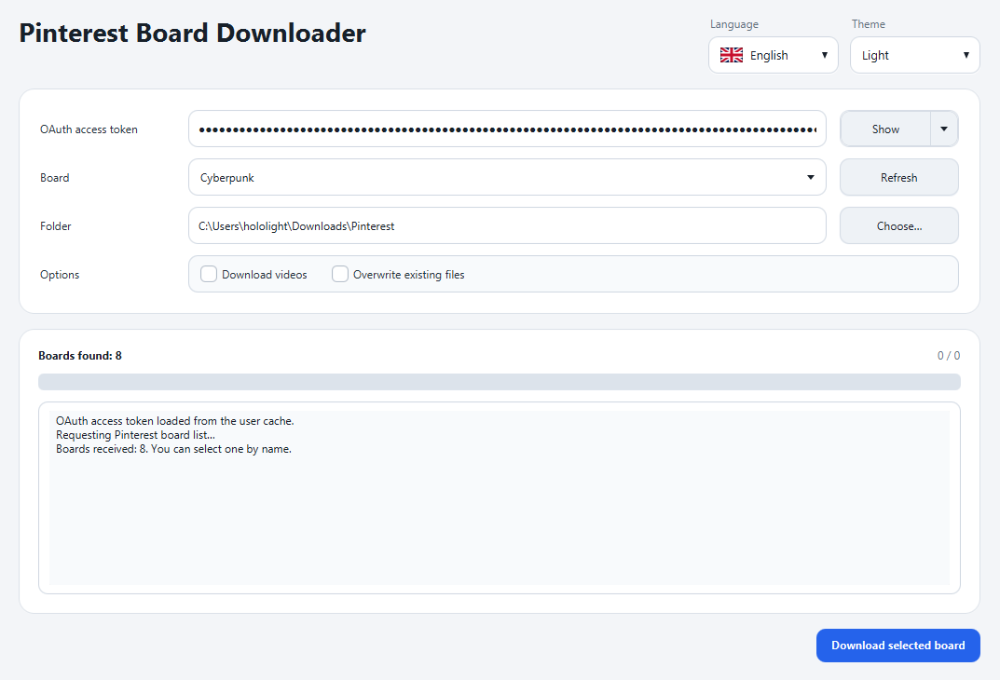

  

# Pinterest Board Downloader

A small desktop app for downloading the contents of your Pinterest boards. It connects to the Pinterest API, loads the boards available to your account, and saves the selected board to a local folder.

